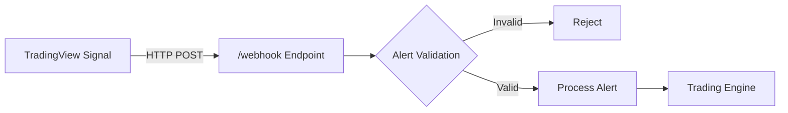
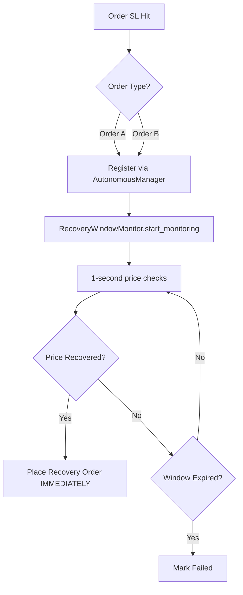
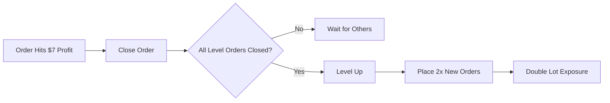
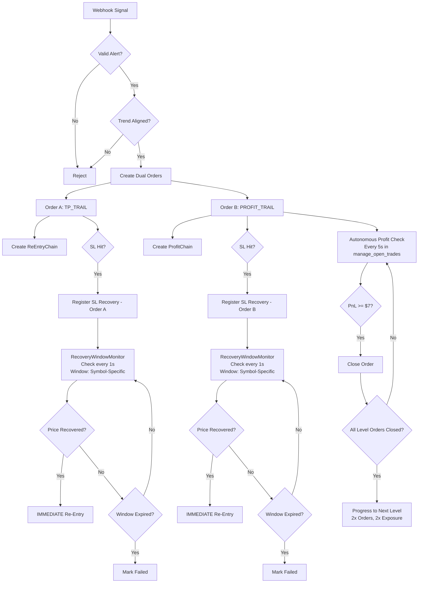
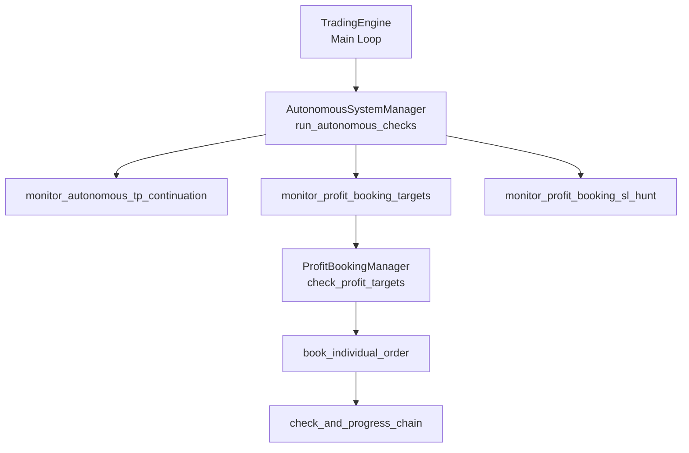

# Zepix Trading Bot - Complete Architecture Documentation

**Document Version:** 1.0  
**Last Updated:** 2025-12-24  
**For:** Developers & System Architects

---

## Table of Contents

1. [System Overview](#system-overview)
2. [Entry Flow: Webhook to Execution](#entry-flow-webhook-to-execution)
3. [Dual Order System](#dual-order-system)
4. [SL Systems (Order A & Order B)](#sl-systems-order-a--order-b)
5. [SL Hunt Recovery System](#sl-hunt-recovery-system)
6. [Profit Booking & Compounding](#profit-booking--compounding)
7. [Telegram Control Interface](#telegram-control-interface)
8. [Flow Diagrams](#flow-diagrams)
9. [Critical File Reference](#critical-file-reference)

---

## 1. System Overview

The Zepix Trading Bot is an advanced autonomous trading system with the following core features:

- **Dual Order Entry:** Simultaneous Order A (TP Trail) and Order B (Profit Trail)
- **SL Hunt Recovery:** Automatic recovery monitoring for Stop Loss hits
- **Profit Booking:** Pyramid compounding system with dynamic level progression
- **Telegram Control:** Real-time configuration and monitoring via Telegram bot
- **Multi-Timeframe Trend Management:** 15m, 1h, 1d trend alignment

---

## 2. Entry Flow: Webhook to Execution

### 2.1 Webhook Entry Point

**File:** `src/main.py`  
**Endpoint:** `POST /webhook`



**Process Flow:**

1. **Webhook Reception** (`main.py:335-358`)
   - Receives JSON payload from TradingView
   - Validates alert structure via `AlertProcessor`
   - Forwards to `TradingEngine.process_alert()`

2. **Alert Processing** (`trading_engine.py:process_alert`)
   - Parses signal type (entry, exit, trend, bias)
   - Validates trend alignment
   - Checks risk limits
   - Routes to execution handler

3. **Execution Decision**
   - **Entry Signal:** → `execute_trades()` → Dual Order Creation
   - **Exit Signal:** → Close open positions
   - **Trend Signal:** → Update trend state
   - **Bias Signal:** → Update bias filter

---

## 3. Dual Order System

### 3.1 Architecture

**File:** `src/managers/dual_order_manager.py`

Every entry signal creates **TWO simultaneous orders**:

| | **Order A** | **Order B** |
|---|---|---|
| **Type** | `TP_TRAIL` | `PROFIT_TRAIL` |
| **Purpose** | TP Continuation Re-Entry | Profit Booking Pyramid |
| **Lot Size** | Same as Order B | Same as Order A |
| **SL Protection** | Has Re-Entry Chain | Has Profit Chain |
| **Chain ID** | `chain_id` | `profit_chain_id` |

### 3.2 Creation Flow

```python
# trading_engine.py:359
dual_result = self.dual_order_manager.create_dual_orders(alert, strategy, account_balance)

# Result structure:
{
    "order_a": Trade object (TP_TRAIL),
    "order_b": Trade object (PROFIT_TRAIL),
    "order_a_placed": bool,
    "order_b_placed": bool,
    "errors": List[str]
}
```

**Key Implementation:**
- Both orders share the **same lot size** (no split)
- Both orders have independent SL hunt registration
- Order A creates `ReEntryChain` for TP continuation
- Order B creates `ProfitBookingChain` for compounding

---

## 4. SL Systems (Order A & Order B)

### 4.1 Overview

The bot supports **FOUR distinct SL calculation systems** across both order types:

#### **Order A (TP_TRAIL)** - Dual SL System:

| System | Name | Type | Switchable |
|---|---|---|---|
| **sl-1** | SL-1 ORIGINAL | Wide/Conservative (Tier-Based) | ✅ Via Telegram |
| **sl-2** | SL-2 RECOMMENDED | Tight/Aggressive (Tier-Based) | ✅ Via Telegram |

#### **Order B (PROFIT_TRAIL)** - Dual SL System:

| System | Name | Type | Switchable |
|---|---|---|---|
| **SL-1.1** | Logic-Specific SL | Variable by Strategy | ✅ Via Telegram |
| **SL-2.1**

| Universal Fixed SL | Fixed $10 for All | ✅ Via Telegram |

---

### 4.2 Order A: TP_TRAIL - Dual SL Systems

**File:** `src/utils/pip_calculator.py`

#### 4.2.1 sl-1: SL-1 ORIGINAL (Default)

**Full Name:** "SL-1 ORIGINAL - User approved volatility-based SL system (Wide/Conservative)"

**Concept:** Wide, conservative SL that adapts by account tier and symbol volatility

**Configuration:** Defined in `config.json` → `sl_systems` → `sl-1`

**Structure:**
```json
"sl-1": {
  "name": "SL-1 ORIGINAL",
  "description": "User approved volatility-based SL system (Wide/Conservative)",
  "symbols": {
    "XAUUSD": {
      "5000": {"sl_pips": 1000, "risk_dollars": 50},
      "10000": {"sl_pips": 1500, "risk_dollars": 150}
    },
    "EURUSD": {
      "5000": {"sl_pips": 150, "risk_dollars": 75},
      "10000": {"sl_pips": 150, "risk_dollars": 150}
    }
  }
}
```

**Characteristics:**
- Wide breathing room for trades
- User-approved conservative approach
- Symbol & tier adaptive
- Higher tier = even wider SL for some pairs

#### 4.2.2 sl-2: SL-2 RECOMMENDED

**Full Name:** "SL-2 RECOMMENDED - Realistic tighter SL system (Tight/Aggressive)"

**Concept:** Tighter SL across all pairs, more aggressive approach

**Configuration:** Defined in `config.json` → `sl_systems` → `sl-2`

**Example:**
```json
"sl-2": {
  "name": "SL-2 RECOMMENDED",
  "description": "Realistic tighter SL system (Tight/Aggressive)",
  "symbols": {
    "XAUUSD": {
      "5000": {"sl_pips": 750, "risk_dollars": 37.5},
      "10000": {"sl_pips": 1000, "risk_dollars": 100}
    },
    "EURUSD": {
      "5000": {"sl_pips": 100, "risk_dollars": 50},
      "10000": {"sl_pips": 100, "risk_dollars": 100}
    }
  }
}
```

**Characteristics:**
- Tighter stops for better risk management
- Recommended for experienced traders
- Lower dollar risk per trade
- Better risk-to-reward ratios

#### 4.2.3 Switching Between sl-1 and sl-2

**Telegram Command:** `/switch_sl_system sl-1` or `/switch_sl_system sl-2`

**Code Reference:** `telegram_bot.py:2147-2165`

**Effect:**
- Updates `config["active_sl_system"]`
- Applies to **all new Order A placements**
- Does **NOT** modify existing open trades
- Persistent across bot restarts

**Verification Command:** `/sl_status` (shows active system)

---

### 4.3 Order B: PROFIT_TRAIL - Dual SL Systems

**File:** `src/utils/profit_sl_calculator.py`

#### 4.3.1 SL-1.1: Logic-Specific SL (Default)


**Concept:** SL dollar amount varies by trading strategy

**Configuration:**
```python
"sl_1_1_settings": {
  "LOGIC1": 20.0,  # Conservative - $20
  "LOGIC2": 40.0,  # Balanced - $40
  "LOGIC3": 50.0   # Aggressive - $50
}
```

**Calculation Logic:**
```python
if self.current_mode == "SL-1.1":
    sl_dollars = sl_settings.get(strategy, 20.0)
    # Convert $ to pips based on lot size
```

**Characteristics:**
- **LOGIC1:** Tighter SL for smaller accounts
- **LOGIC2:** Balanced risk
- **LOGIC3:** Wider SL for trend-following

#### 4.3.2 SL-2.1: Universal Fixed SL

**Concept:** Fixed $10 SL for **all** logics and levels

**Configuration:**
```python
"sl_2_1_settings": {
  "fixed_sl": 10.0  # Universal $10
}
```

**Calculation Logic:**
```python
else:  # SL-2.1
    sl_dollars = sl_settings.get("fixed_sl", 10.0)
```

**Characteristics:**
- Tight risk for profit compounding
- Simplifies profit calculations
- Enables faster level progression

#### 4.3.3 Switching Between SL-1.1 and SL-2.1

**Telegram Command:** `/profit_sl_mode SL-1.1` or `/profit_sl_mode SL-2.1`

**Code Reference:** `telegram_bot.py:2856-2885`

**Effect:**
- Updates `config["profit_booking_config"]["sl_system"]`
- Applies to **all new Order B placements**
- Does **NOT** modify existing profit chains
- Persistent across bot restarts

**Verification Command:** `/profit_status` (shows active SL mode)

---

### 4.4 Custom SL Adjustments

#### 4.4.1 For Order A (SL-1/SL-2)

**Symbol-Specific Reductions:**
```python
"symbol_sl_reductions": {
  "XAUUSD": 10,  # Reduce Gold SL by 10%
  "BTCUSD": 15   # Reduce BTC SL by 15%
}
```

**Telegram Command:** `/sl_reduce XAUUSD 10`

#### 4.4.2 For Order B (SL-1.1 Only)

**Logic-Specific Custom Values:**

**Telegram Command:** `/profit_sl_set LOGIC1 25`

**Effect:**
- Changes SL-1.1 value for specific logic
- Only works when in SL-1.1 mode
- Example: Set LOGIC1 to $25 instead of default $20

**Code Reference:** `telegram_bot.py:3172-3221`

---

### 4.5 Summary Table: Complete SL Matrix

| Order | SL System | Name | Type | Default SL (Example) | Command |
|---|---|---|---|---|---|
| **Order A** | sl-1 | SL-1 ORIGINAL | Wide/Conservative | XAUUSD Tier $5K: 1000 pips | `/switch_sl_system sl-1` |
| **Order A** | sl-2 | SL-2 RECOMMENDED | Tight/Aggressive | XAUUSD Tier $5K: 750 pips | `/switch_sl_system sl-2` |
| **Order B** | SL-1.1 | Logic-Specific SL | Variable by Strategy | LOGIC1: $20, LOGIC2: $40, LOGIC3: $50 | `/profit_sl_mode SL-1.1` |
| **Order B** | SL-2.1 | Universal Fixed SL | Fixed for All | All Logics: $10 | `/profit_sl_mode SL-2.1` |

**Key Insights:** 
- **Order A** uses **pip-based** SL systems (sl-1 ORIGINAL = wide, sl-2 RECOMMENDED = tight)
- **Order B** uses **dollar-based** SL systems (SL-1.1 = logic-specific, SL-2.1 = universal)
- Order A focuses on account tier adaptation
- Order B focuses on profit-to-risk simplicity

---

---

## 5. SL Hunt Recovery System

### 5.1 Architecture

**Files:**
- `src/managers/recovery_window_monitor.py` (Price Monitor)
- `src/managers/autonomous_system_manager.py` (Orchestrator)

### 5.2 Trigger Mechanism



**Critical Code Path:**
```python
# trading_engine.py:1054-1060 (FIXED)
if hasattr(self, 'autonomous_manager') and self.autonomous_manager:
    self.autonomous_manager.register_sl_recovery(trade, trade.strategy)
```

### 5.3 Symbol-Specific Recovery Windows

**Configuration:** `recovery_window_monitor.py:27-67`

| Symbol | Window | Volatility |
|---|---|---|
| BTCUSD | 12 min | High |
| XAUUSD | 15 min | High |
| EURUSD | 30 min | Medium |
| GBPUSD | 22 min | Medium-High |
| USDCHF | 35 min | Low |
| Exotics | 45-50 min | Very High |

### 5.4 Recovery Execution

**Behavior:** **IMMEDIATE** entry upon price recovery

**Evidence:**
```python
# recovery_window_monitor.py:211-214
if is_recovered:
    # ✅ IMMEDIATE ACTION - Price recovered!
    await self._handle_recovery(order_id, current_price, elapsed)
    break  # Exits loop immediately
```

- **NOT** a forced wait for full window duration
- Window acts as **maximum timeout**
- Monitoring interval: **1 second** precision

---

## 6. Profit Booking & Compounding

### 6.1 System Overview

**File:** `src/managers/profit_booking_manager.py`

Order B (PROFIT_TRAIL) follows a pyramid compounding system:

| Level | Orders | Lot Multiplier | Target/Order | Total Target |
|---|---|---|---|---|
| 0 (Initial) | 1 | 1x | $7 | $7 |
| 1 | 2 | 2x | $7 | $14 |
| 2 | 4 | 4x | $7 | $28 |
| 3 | 8 | 8x | $7 | $56 |
| 4 (Max) | 16 | 16x | $7 | $112 |

### 6.2 Level Progression Logic



**Critical Rule:** Level progression **only happens** when **ALL** orders in the current level are closed.

### 6.3 Autonomous Detection (NEW FIX)

**File:** `src/managers/autonomous_system_manager.py:262-302`

```python
async def monitor_profit_booking_targets(self, open_trades, trading_engine):
    """Monitor active profit chains for PnL targets"""
    for chain_id, chain in active_chains.items():
        # Check each order's individual PnL
        orders_to_book = self.profit_booking_manager.check_profit_targets(chain, open_trades)
        
        for trade in orders_to_book:
            # Book immediately
            await self.profit_booking_manager.book_individual_order(...)
            
            # Check if level is complete
            await self.profit_booking_manager.check_and_progress_chain(...)
```

**Integration:** Called every 5 seconds via `TradingEngine.manage_open_trades()` loop.

---

## 7. Telegram Control Interface

### 7.1 Main Command Categories

**File:** `src/clients/telegram_bot.py`

#### 7.1.1 Status & Monitoring
- `/status` - Current bot state, open trades, PnL
- `/health` - System health check
- `/view_risk_status` - Risk exposure and limits
- `/session_report_{id}` - Detailed session analytics

#### 7.1.2 Trading Control
- `/pause_trading` - Pause new entries
- `/resume_trading` - Resume trading
- `/close_all` - Emergency close all positions
- `/close_symbol BTCUSD` - Close specific symbol

#### 7.1.3 Logic Control
- `/enable_logic 1` - Enable LOGIC1
- `/disable_logic 2` - Disable LOGIC2
- `/logic_status` - View enabled logics

#### 7.1.4 Trend Management
- `/set_trend EURUSD 15m bullish MANUAL` - Manual trend lock
- `/unlock_trend EURUSD 15m` - Unlock trend
- `/get_trends` - View all current trends

#### 7.1.5 Re-Entry System
- `/reentry_status` - View active re-entry chains
- `/toggle_tp_reentry` - Enable/disable TP continuation
- `/toggle_sl_hunt` - Enable/disable SL hunt recovery

#### 7.1.6 Profit Booking Control
- `/profit_status` - View active profit chains
- `/profit_sl_mode SL-1.1` - Switch SL system
- `/profit_sl_set LOGIC1 25` - Set custom SL-1.1 value
- `/profit_target_set 10` - Change profit target

#### 7.1.7 Risk Management
- `/set_daily_loss 500` - Set daily loss limit
- `/set_lifetime_loss 2000` - Set lifetime loss limit
- `/switch_tier 2` - Switch to different risk tier

### 7.2 Callback Buttons (Interactive Menus)

**File:** `src/menu/menu_manager.py`

- **Main Menu:** Logic Control, Re-Entry, Profit Booking, Risk
- **Profit Booking Menu:** SL Mode, Target, Levels, Status
- **Re-Entry Menu:** TP Continuation, SL Hunt, Settings
- **Risk Menu:** Tier Selection, Loss Limits, Lot Override

---

## 8. Flow Diagrams

### 8.1 Complete Entry to SL Hunt Flow



### 8.2 Autonomous System Architecture



---

## 9. Critical File Reference

### 9.1 Core Entry & Execution

| File | Purpose |
|---|---|
| `src/main.py` | Webhook endpoint, FastAPI server |
| `src/core/trading_engine.py` | Main orchestration, trade lifecycle |
| `src/processors/alert_processor.py` | Alert validation and parsing |
| `src/managers/dual_order_manager.py` | Dual order creation logic |

### 9.2 SL Systems

| File | Purpose |
|---|---|
| `src/utils/pip_calculator.py` | sl-1 & sl-2 calculator (Order A - TP Trail) |
| `src/utils/profit_sl_calculator.py` | SL-1.1 & SL-2.1 calculator (Order B - Profit Trail) |

### 9.3 Autonomous Systems

| File | Purpose |
|---|---|
| `src/managers/autonomous_system_manager.py` | Central autonomous orchestrator |
| `src/managers/recovery_window_monitor.py` | SL hunt price monitoring |
| `src/managers/profit_booking_manager.py` | Profit compounding logic |
| `src/managers/reentry_manager.py` | TP continuation chains |

### 9.4 Control Interface

| File | Purpose |
|---|---|
| `src/clients/telegram_bot.py` | Telegram command handlers |
| `src/menu/menu_manager.py` | Interactive button menus |
| `src/menu/profit_booking_menu_handler.py` | Profit booking menu logic |

### 9.5 Data Models

| File | Purpose |
|---|---|
| `src/models.py` | Trade, Chain, Alert data classes |
| `src/database/trade_database.py` | SQLite persistence |
| `src/config.py` | Configuration loader |

---

## 10. Additional Features Not Covered Above

### 10.1 Exit Continuation Monitoring

**File:** `src/managers/exit_continuation_monitor.py`

- Monitors trades closed by trend reversal or manual exit
- Waits for trend to realign
- Automatically re-enters if alignment restored

### 10.2 Session Management

**File:** `src/services/session_manager.py`

- Tracks trading sessions per symbol
- Calculates win rate, PnL, and statistics
- Generates `/session_report` on completion

### 10.3 Dual SL System (Order A Specific)

**File:** `src/managers/dual_sl_manager.py`

- **Standard SL:** Hard stop loss in MT5
- **Activation SL:** Triggers SL hunt recovery
- Provides two-layer protection for Order A

---

## 11. Developer Notes

### 11.1 Critical Wiring Points

1. **SL Hunt Registration:**
   - **MUST** call `autonomous_manager.register_sl_recovery()`
   - **NOT** `price_monitor.register_sl_hunt()` (legacy)

2. **Profit Booking Detection:**
   - Driven by `run_autonomous_checks()` in main loop
   - **NOT** autonomous/independent timer

3. **Order Type Tags:**
   - Order A: `order_type = "TP_TRAIL"`
   - Order B: `order_type = "PROFIT_TRAIL"`
   - Critical for routing logic

### 11.2 Common Pitfalls

1. **Variable Name:** Use `self.autonomous_manager` NOT `self.autonomous_system_manager`
2. **Recovery Window:** Is a MAX timeout, not a forced wait
3. **Level Progression:** Requires ALL orders closed, not just profit target reached
4. **SL System Confusion:** 
   - Order A: Uses sl-1 ORIGINAL (wide) or sl-2 RECOMMENDED (tight)
   - Order B: Uses SL-1.1 (logic-specific) or SL-2.1 (universal $10)

---

**END OF DOCUMENT**
