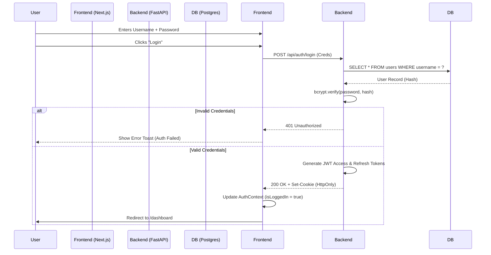

# WF-01: LOGIN FLOW SEQUENCE
**Component ID:** WF-01  
**Type:** Sequence Diagram  
**Actors:** User, Frontend, Backend, DB

---

## 1. 📝 Description
The complete journey from entering credentials to landing on the dashboard.

## 2. 🌊 Sequence

## 3. 🔍 Key Controls
- **Rate Limiting:** If user fails > 5 times, block IP for 15 mins.
- **Cookie Flags:** `HttpOnly` prevents XSS token theft.

---

##  IMPORTANT IMPLEMENTATION & COMPLIANCE NOTE
1. **Codebase Synchronization:** Before implementing this component, ALWAYS scan the full ZepixTradingBot codebase for recent updates.
2. **Creative License:** This document is a foundational blueprint. The Agent is authorized to use creative freedom to make the Frontend modern, animated, and premium.
3. **Backend Alignment:** Backend and Database logic must be derived from a deep analysis of the *current* bot behavior and code structure.
4. **Live Verification:** After completing this file, you must perform a LIVE test to verify Web-Bot connectivity and functionality immediately.

