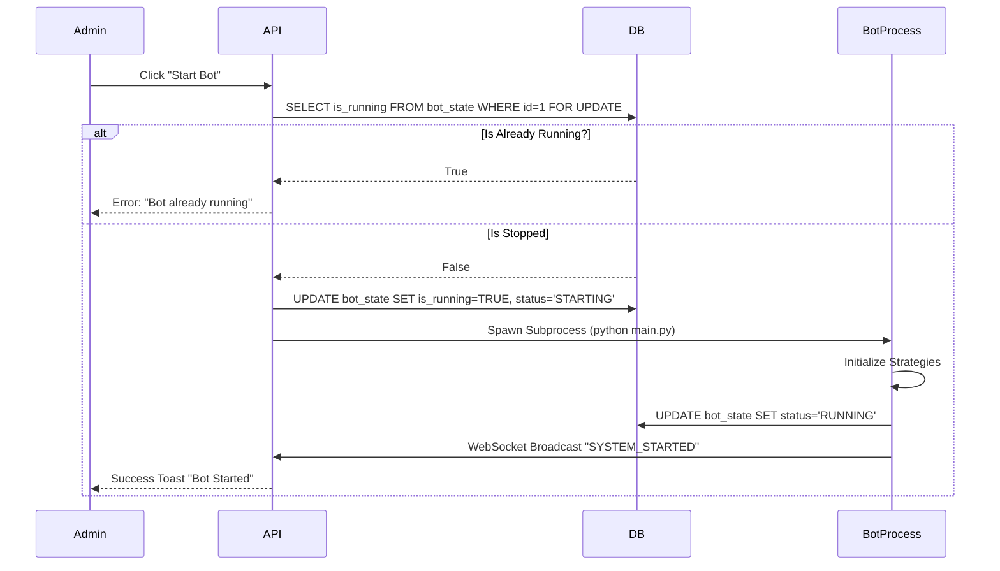

# WF-02: BOT START SEQUENCE
**Component ID:** WF-02  
**Type:** Sequence Diagram  
**Actors:** Admin, API, Database, Bot Process

---

## 1. 📝 Description
Logic for safely starting the trading engine, ensuring no duplicates run.

## 2. 🌊 Sequence

## 3. 🔍 Safety
- **Row Lock:** `FOR UPDATE` prevents race condition if two admins click start simultaneously.

---

##  IMPORTANT IMPLEMENTATION & COMPLIANCE NOTE
1. **Codebase Synchronization:** Before implementing this component, ALWAYS scan the full ZepixTradingBot codebase for recent updates.
2. **Creative License:** This document is a foundational blueprint. The Agent is authorized to use creative freedom to make the Frontend modern, animated, and premium.
3. **Backend Alignment:** Backend and Database logic must be derived from a deep analysis of the *current* bot behavior and code structure.
4. **Live Verification:** After completing this file, you must perform a LIVE test to verify Web-Bot connectivity and functionality immediately.

