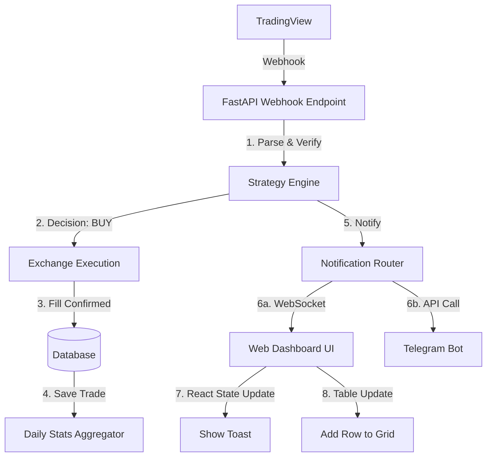

# WF-03: LIVE ALERT FLOW
**Component ID:** WF-03  
**Type:** Data Flow  
**Trigger:** TradingView Webhook

---

## 1. 📝 Description
How a signal travels from sources to the user's screen in real-time.

## 2. 🌊 Flow Diagram

## 3. ⚡ Latency Budget
- Webhook -> DB: < 100ms
- Webhook -> Websocket Push: < 200ms
- **Goal:** User sees trade on dashboard same second it happens.

---

##  IMPORTANT IMPLEMENTATION & COMPLIANCE NOTE
1. **Codebase Synchronization:** Before implementing this component, ALWAYS scan the full ZepixTradingBot codebase for recent updates.
2. **Creative License:** This document is a foundational blueprint. The Agent is authorized to use creative freedom to make the Frontend modern, animated, and premium.
3. **Backend Alignment:** Backend and Database logic must be derived from a deep analysis of the *current* bot behavior and code structure.
4. **Live Verification:** After completing this file, you must perform a LIVE test to verify Web-Bot connectivity and functionality immediately.

