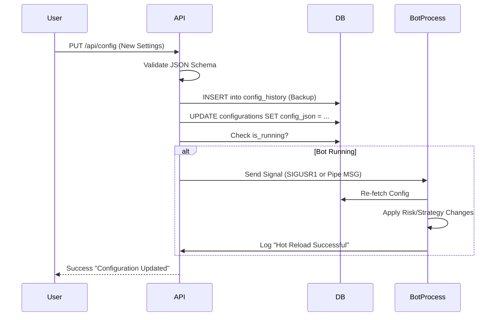

# WF-04: CONFIG UPDATE FLOW
**Component ID:** WF-04  
**Type:** Sequence Diagram  
**Context:** Editing Bot Settings

---

## 1. 📝 Description
Process for updating hot-swappable settings without restarting the engine.

## 2. 🌊 Sequence

## 3. ⚠️ Constraints
- Critical Exchange connection settings usually require a full **Restart**.
- Strategy parameters (SL/TP) handle **Hot Reload**.

---

##  IMPORTANT IMPLEMENTATION & COMPLIANCE NOTE
1. **Codebase Synchronization:** Before implementing this component, ALWAYS scan the full ZepixTradingBot codebase for recent updates.
2. **Creative License:** This document is a foundational blueprint. The Agent is authorized to use creative freedom to make the Frontend modern, animated, and premium.
3. **Backend Alignment:** Backend and Database logic must be derived from a deep analysis of the *current* bot behavior and code structure.
4. **Live Verification:** After completing this file, you must perform a LIVE test to verify Web-Bot connectivity and functionality immediately.

