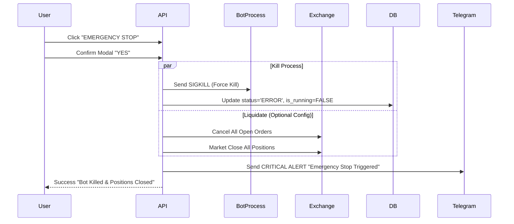

# WF-05: EMERGENCY STOP FLOW
**Component ID:** WF-05  
**Type:** Critical Procedure  
**Trigger:** Panic Button

---

## 1. 📝 Description
The "Kill Switch" logic ensuring immediate cessation of trading and (optionally) liquidating positions.

## 2. 🌊 Sequence

## 3. 🛡️ Failsafe
- If API cannot reach Exchange (Network Error), it prioritizes killing the Bot Process first to prevent *new* orders.

---

##  IMPORTANT IMPLEMENTATION & COMPLIANCE NOTE
1. **Codebase Synchronization:** Before implementing this component, ALWAYS scan the full ZepixTradingBot codebase for recent updates.
2. **Creative License:** This document is a foundational blueprint. The Agent is authorized to use creative freedom to make the Frontend modern, animated, and premium.
3. **Backend Alignment:** Backend and Database logic must be derived from a deep analysis of the *current* bot behavior and code structure.
4. **Live Verification:** After completing this file, you must perform a LIVE test to verify Web-Bot connectivity and functionality immediately.

