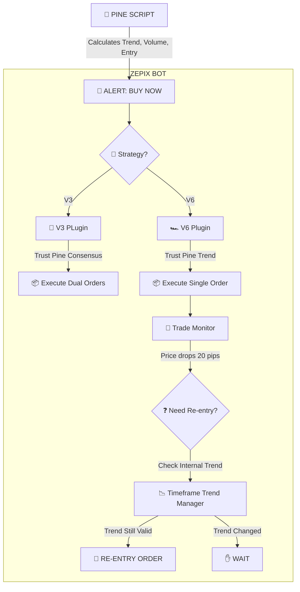

# ZEPIX BOT: CORRECTED LOGIC FLOW (PINE SUPREMACY)

Ye document explain karta hai ki **Bot ko kaise kaam karna chahiye** (based on User's Correct Logic).

---

## 🌳 1. PHILOSOPHY: "PINE IS BOSS"

TradingView ka Pine Script hi **Dimag** hai. Bot sirf **Haath** hai.

- **Pine Script:** Market scan karega, Trend dekhega, Decision lega.
- **Bot:** Chup-chap order lagayega. (No extra questions asked).

---

## 🌳 2. SIGNAL AAYA (Signal Received)

TradingView se signal aata hai.

```text
🌎 TRADINGVIEW (Brain)
      │
      ├── "Trend Bullish hai, maine check kar liya."
      ├── "Volume accha hai."
      └── "Signal: BUY EURUSD Abhi!"
      │
      ▼
📨 WEBHOOK (Packet)
      │
      └── Contains: { "symbol": "EURUSD", "action": "BUY", "trend": "BULLISH" }
```

---

## 🌳 3. BOT REACTION (No Extra Brain)

Bot ko signal mila. Usse **APNA** trend check nahi karna chahiye.

### **❌ GALAT FLOW (Jo Devin ne bana diya tha)**
Bot: "Ruko! Pine ne bola BUY, par main apna ADX check karunga."
Bot: "Mera ADX keh raha hai market slow hai. **REJECT!**"
👉 **Result:** Valid trade miss ho gaya kyunki Bot ka ADX data purana tha ya alag tha.

### **✅ SAHI FLOW (Jo Aap Chahte Hain)**
Bot: "Pine ne bola BUY? Okay, Boss. **ACCEPTED.**"
Bot: "Main bas Risk Management (Lot Size) check karunga aur Order laga dunga."

---

## 🌳 4. TREND ALIGNMENT KA SAHI USE (Re-Entry Only)

Toh phir Bot ke andar **Trend Manager** kyun hai?
👉 Sirf **RE-ENTRY** (Recovery) ke liye.

**Scenario:**
1. **Entry:** Pine ke signal par le li. (Bot ne trend check nahi kiya).
2. **Loss:** Trade minus mein chala gaya.
3. **Re-Entry Decision:** Ab Pine se naya signal nahi aa raha. Bot ko khud decide karna hai ki average kare ya nahi.
4. **AB Bot Trend Check Karega:** "Kya abhi bhi 15m aur 1H trend same hai? Agar haan, toh Re-entry lo."

```text
🛑 ENTRY TIME (Signal Aaya)
      │
      └──👉 EXECUTE DIRECTLY (Don't check trend)

🛑 RE-ENTRY TIME (Loss Recover Karna Hai)
      │
      └──❓ POOCHO: "Kya Trend abhi bhi valid hai?"
            │
            ├── YES ──► Re-entry Lo (Recovery)
            └── NO  ──► Wait karo (Don't fight trend)
```

---

## 🌳 5. CORRECTED ARCHITECTURE DIAGRAM



---

## 📝 FINAL VERDICT

1. **Entry:** 100% Pine Script par depend karegi. Bot koi filter nahi lagayega.
2. **Logic:** V3 aur V6 dono apne Pine Script ke logic ko follow karenge.
3. **Trend Manager:** Sirf **bad** mein (Trade manage karte waqt) kaam aayega.

Ye hai wo **Asli Design** jo aap chahte hain. Devin ko yehi implement karna chahiye tha.
